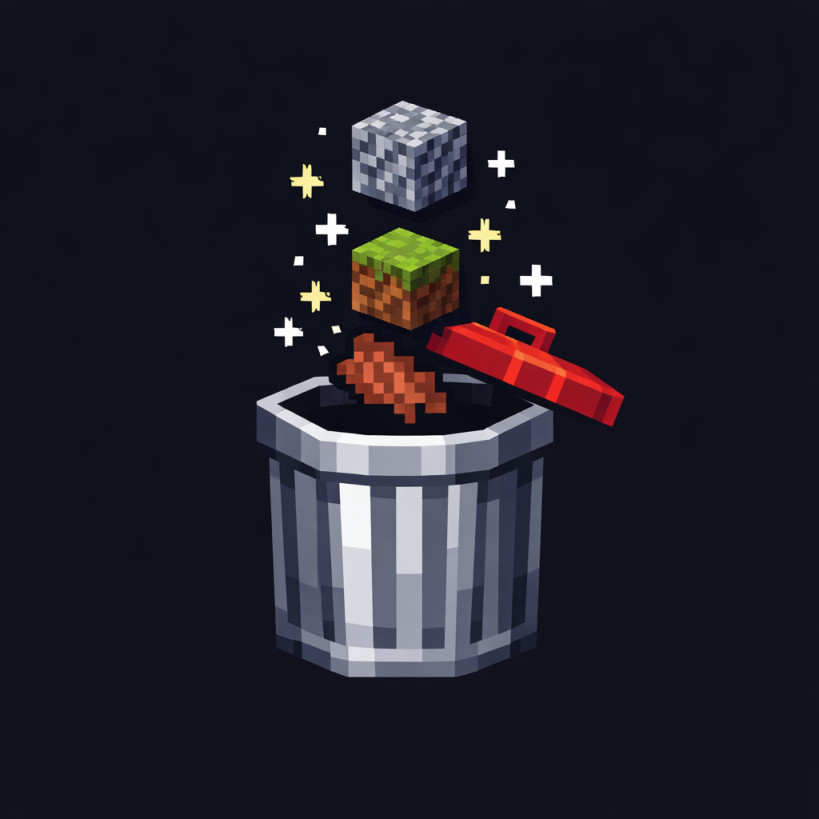
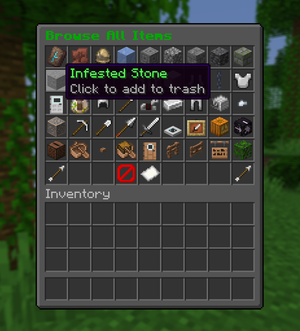
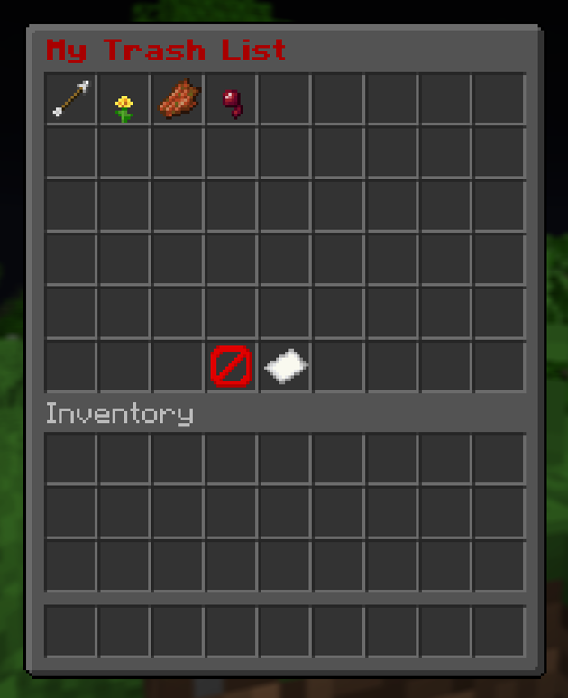

# AutoTrash

<p align="center">
  
</p>

 
<!-- [](https://modrinth.com/plugin/autotrash) -->

A PaperMC plugin that lets players automatically trash unwanted items on pickup. Each player manages their own trash list through an in-game GUI or commands.

## Features

When an item is added to the trash list, it will be automatically deleted when picked up, similar to the /trash command other plugins have. Additionally, the plugin also provides a GUI for managing the trash list and a command for listing trashed items.

## Requirements

- Paper or Purpur 1.20.6+

## Commands

| Command | Description |
|---------|-------------|
| `/autotrash` | Open the main menu GUI |
| `/autotrash add <material>` | Add an item to your trash list |
| `/autotrash remove <material>` | Remove an item from your trash list |
| `/autotrash list` | Show your trashed items in chat |
| `/autotrash reload` | Reload config.yml |

Alias: `/atrash`

## Permissions

| Permission | Default | Description |
|-----------|---------|-------------|
| `autotrash.use` | All players | Use `/autotrash` commands and GUI |
| `autotrash.admin` | OP only | Reload config |

## Configuration

```yaml
# Number of items shown in the "Most Trashed" GUI
most-trashed-limit: 45
```

## Gallery



